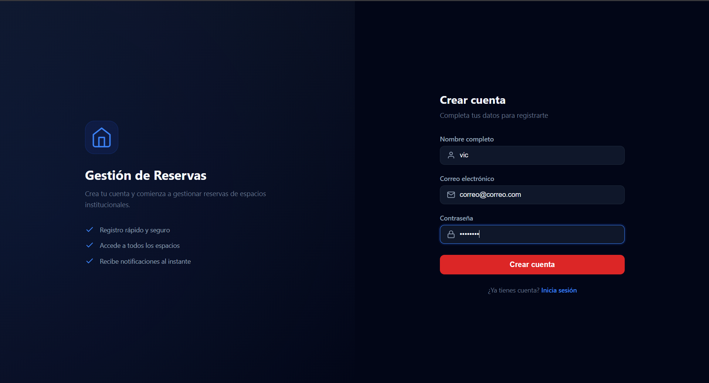
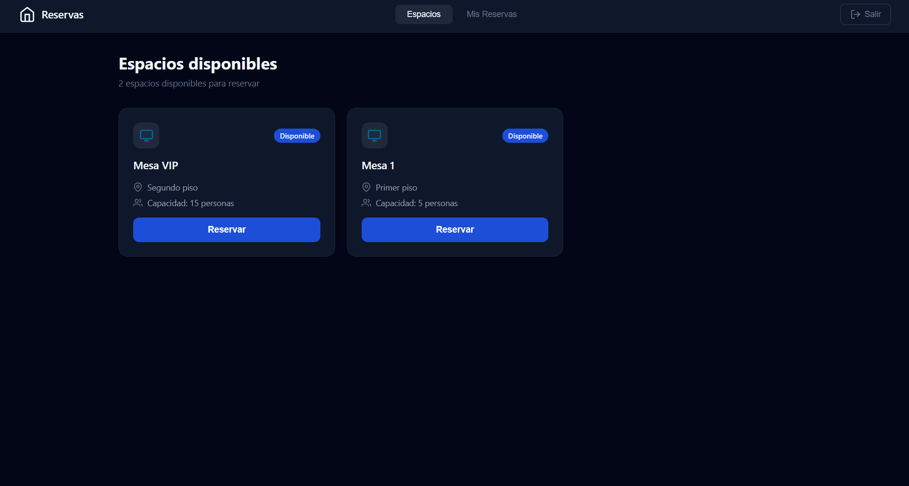
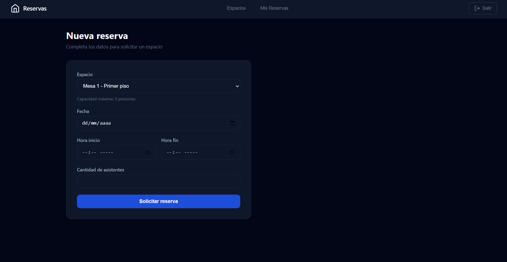
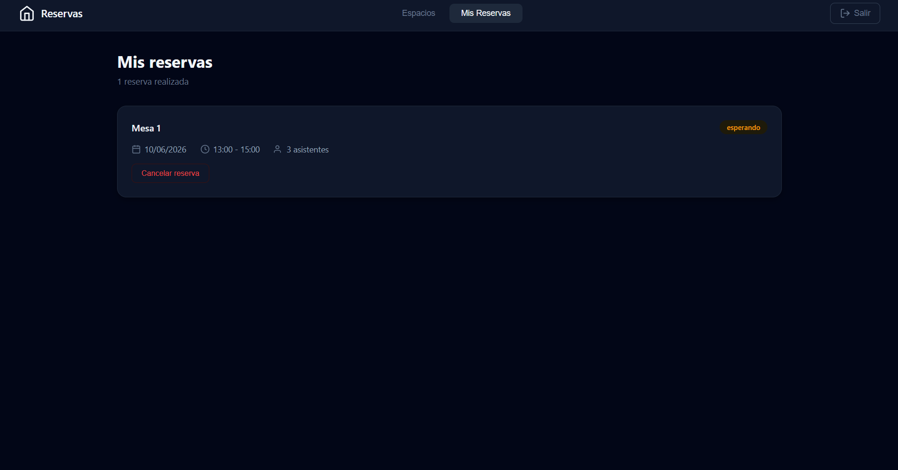
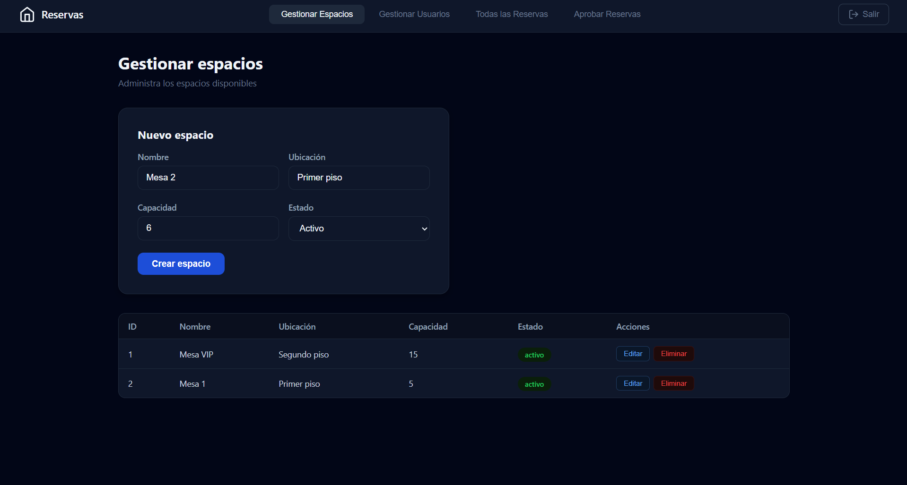
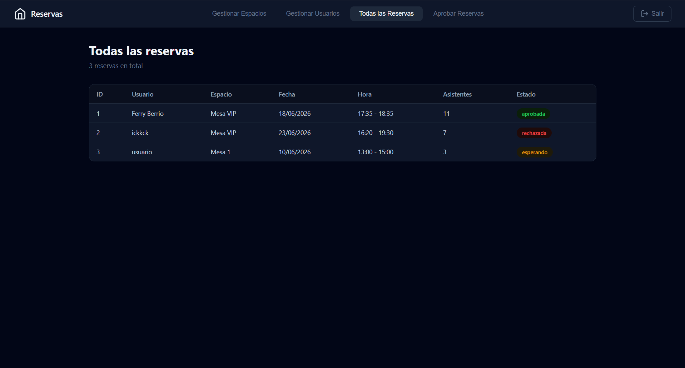
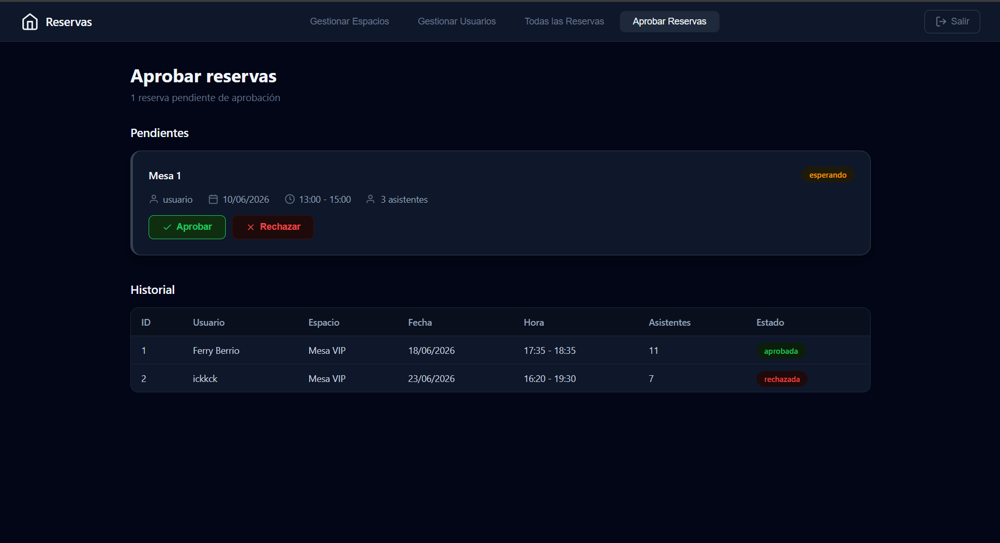

# Gestión de Reservas de Espacios Institucionales

**Sistema web para la administración y reserva de espacios institucionales como salas de reuniones, laboratorios, auditorios y aulas especiales.**

---

## Tabla de Contenido

1. [Descripción General](#descripción-general)
2. [Equipo de Trabajo](#equipo-de-trabajo)
3. [Arquitectura y Tecnologías](#arquitectura-y-tecnologías)
4. [Resumen del Despliegue](#resumen-del-despliegue)
5. [Requisitos y Reglas de Negocio](#requisitos-y-reglas-de-negocio)
6. [Tutorial de Uso](#tutorial-de-uso)
   - [Inicio de Sesión](#inicio-de-sesión)
   - [Registro de Usuario](#registro-de-usuario)
   - [Vista de Usuario: Consultar Espacios](#vista-de-usuario-consultar-espacios)
   - [Vista de Usuario: Crear Reserva](#vista-de-usuario-crear-reserva)
   - [Vista de Usuario: Mis Reservas](#vista-de-usuario-mis-reservas)
   - [Vista de Administrador: Gestionar Espacios](#vista-de-administrador-gestionar-espacios)
   - [Vista de Administrador: Todas las Reservas](#vista-de-administrador-todas-las-reservas)
   - [Vista de Administrador: Aprobar Reservas](#vista-de-administrador-aprobar-reservas)
   - [Mensajes de Error](#mensajes-de-error)
   - [Cierre de Sesión](#cierre-de-sesión)
7. [Casos de Uso y Validaciones](#casos-de-uso-y-validaciones)
8. [Conclusiones y Aprendizajes](#conclusiones-y-aprendizajes)

---

## Descripción General

### ¿Qué hace la aplicación?

La aplicación permite a los usuarios de una institución educativa o corporativa **reservar espacios compartidos** (salas de reuniones, laboratorios, auditorios, aulas especiales) de forma rápida y sin conflictos de horario. Un administrador revisa y aprueba o rechaza cada solicitud.

### ¿Qué problema resuelve?

Antes de este sistema, las reservas se gestionaban mediante correos electrónicos, hojas de cálculo o comunicación verbal, lo que generaba:
- **Choques de horarios** (dos personas reservando el mismo espacio a la misma hora)
- **Falta de control** sobre quién reserva y para qué
- **Procesos manuales** de aprobación lentos y desorganizados

El sistema automatiza todo el flujo: el usuario solicita, el sistema valida disponibilidad y reglas, el administrador aprueba o rechaza.

### Objetivo

Desarrollar y desplegar una aplicación web funcional integrando frontend (React), backend (FastAPI) y base de datos (PostgreSQL), aplicando autenticación JWT, control de roles, reglas de negocio, control de versiones con Git/GitHub y despliegue mediante Docker Compose en un servidor Linux.

---

## Equipo de Trabajo

| Integrante | Rol |
|---|---|
| **Alejo Spiria** | Desarrollador full-stack, DevOps y documentación |

> Proyecto desarrollado de forma individual como parte del Laboratorio 4 de Aplicaciones y Servicios Web.

---

## Arquitectura y Tecnologías

### Arquitectura general

```
Navegador ──► :3000 ──► Nginx (proxy reverso)
                           ├── /, /assets/       → Frontend React (estático)
                           ├── /auth/*           ──► Backend FastAPI :8000
                           ├── /usuarios/*       ──► Backend FastAPI :8000
                           ├── /espacios/*       ──► Backend FastAPI :8000
                           └── /reservas/*       ──► Backend FastAPI :8000
                                                     └── PostgreSQL :5432
```

### Tecnologías utilizadas

| Herramienta | Versión | Propósito |
|---|---|---|
| **Python** | 3.11 | Lenguaje del backend |
| **FastAPI** | 0.136.3 | Framework web ASGI para la API REST |
| **SQLAlchemy** | 2.0.50 | ORM para la base de datos |
| **PostgreSQL** | 17 | Base de datos relacional |
| **Uvicorn** | 0.48.0 | Servidor ASGI |
| **python-jose** | 3.5.0 | Generación y validación de JWT |
| **passlib** + **bcrypt** 4.1.3 | — | Hash seguro de contraseñas |
| **React** | 19 | Librería para la interfaz de usuario |
| **Vite** | 8 | Bundler y servidor de desarrollo |
| **TypeScript** | 5.8 | Tipado estático en el frontend |
| **React Router DOM** | 7 | Navegación SPA |
| **Docker** | — | Contenerización de servicios |
| **Docker Compose** | V2 | Orquestación de contenedores |
| **Nginx** | Alpine | Proxy reverso y servidor de archivos estáticos |

### Diseño visual

La interfaz utiliza un **Bento Box design** con paleta oscura:

| Elemento | Color |
|---|---|
| Fondo general | `#020617` (azul profundo) |
| Tarjetas y navbar | `#0F172A` (superficie) |
| Botones y acentos | `#1D4ED8` (azul) |
| Texto principal | `#F1F5F9` (blanco hueso) |
| Texto secundario | `#94A3B8` (gris claro) |

---

## Resumen del Despliegue

El sistema se despliega en un **servidor Ubuntu 22.04** usando **Docker Engine** y **Docker Compose V2**. Está compuesto por tres contenedores:

| Contenedor | Imagen | Puerto expuesto |
|---|---|---|
| **Frontend** | Nginx sirviendo React build | `:3000` |
| **Backend** | Python FastAPI (Uvicorn) | `:8000` |
| **Base de datos** | PostgreSQL 16 Alpine | `127.0.0.1:5432` (solo localhost) |

### Comandos principales

```bash
# Desplegar
docker compose up -d --build

# Ver estado
docker compose ps

# Ver logs
docker compose logs -f

# Detener
docker compose down

# Eliminar todo (incluyendo datos)
docker compose down -v
```

> Para más detalle sobre el despliegue, consultar la rama [`ops`](https://github.com/aleospiria/gestion-reservas/tree/ops).

---

## Requisitos y Reglas de Negocio

### Requisitos funcionales implementados

| ID | Requisito | Estado |
|---|---|---|
| A | Inicio de sesión con autenticación JWT | ✅ |
| B | Control de acceso según rol (`admin` / `usuario`) | ✅ |
| C | Registrar usuarios | ✅ |
| D | Consultar usuarios registrados | ✅ |
| E | Registrar espacios institucionales | ✅ |
| F | Consultar espacios disponibles | ✅ |
| G | Crear reservas | ✅ |
| H | Consultar reservas realizadas | ✅ |
| I | Actualizar el estado de una reserva | ✅ |
| J | Cancelar una reserva | ✅ |
| K | Validar disponibilidad antes de crear una reserva | ✅ |
| L | Mostrar mensajes de error cuando una reserva no cumpla las reglas de negocio | ✅ |

### Reglas de negocio (C–I)

| ID | Regla | Cómo se valida |
|---|---|---|
| **C** | No permitir reservas superpuestas | Consulta SQL que verifica cruce de horarios en el mismo espacio y fecha |
| **D** | Mínimo 24 horas de anticipación | Compara `fecha + hora_inicio` contra `now + 24h` |
| **E** | Horario permitido: L–V 7:00–20:00, Sáb 8:00–12:00 | Validación por día de semana y hora |
| **F** | Hora inicio debe ser menor a hora fin | Comparación directa entre los dos campos |
| **G** | No reservar espacios inactivos | Verifica `estado == "activo"` del espacio |
| **H** | Capacidad máxima: asistentes ≤ capacidad del espacio | Compara `cantidad_asistentes` con `espacio.capacidad` |
| **I** | Estado inicial `esperando`, solo admin puede aprobar/rechazar | Rol `admin` requerido en endpoint PUT /estado |

---

## Tutorial de Uso

### Inicio de Sesión

> **Pantalla de inicio de sesión con diseño dividido.** A la izquierda un panel institucional con el nombre de la aplicación y una ilustración SVG; a la derecha el formulario con campos de correo y contraseña.


**Pasos:**
1. Ingresa tu **correo electrónico** registrado
2. Ingresa tu **contraseña**
3. Haz clic en **"Iniciar Sesión"**
4. Serás redirigido automáticamente según tu rol:
   - **Usuario** → vista de espacios disponibles
   - **Administrador** → panel de gestión

**Credenciales por defecto (admin):**
- Correo: `admin@reservas.com`
- Contraseña: `admin123`

---

### Registro de Usuario

> **Pantalla de registro con el mismo diseño dividido.** El formulario solicita nombre completo, correo electrónico y contraseña.



**Pasos:**
1. Haz clic en **"¿No tienes cuenta? Regístrate"** en la pantalla de login
2. Completa los campos: **Nombre**, **Correo**, **Contraseña**
3. Haz clic en **"Registrarse"**
4. Serás redirigido al login para iniciar sesión

> Los nuevos usuarios se registran con rol `usuario`. Solo un administrador puede crear otros administradores.

---

### Vista de Usuario: Consultar Espacios

> **Grid tipo Bento Box** que muestra todos los espacios disponibles. Cada tarjeta incluye nombre, ubicación, capacidad y un botón "Reservar".



**Funcionalidad:**
- Los espacios con estado `inactivo` o `mantenimiento` no se muestran
- Cada tarjeta tiene un efecto hover con elevación
- El botón **"Reservar"** redirige al formulario de creación

---

### Vista de Usuario: Crear Reserva

> **Formulario** con campos: espacio (selección), fecha, hora inicio, hora fin y cantidad de asistentes.



**Pasos:**
1. Selecciona el **espacio** del menú desplegable
2. Elige la **fecha** (debe ser al menos 24h después del momento actual)
3. Define **hora de inicio** y **hora de fin**
4. Ingresa la **cantidad de asistentes** (no puede exceder la capacidad del espacio)
5. Haz clic en **"Reservar"**

**Validaciones en tiempo real:**
- La fecha debe ser al menos 1 día después de hoy
- La hora de inicio debe ser anterior a la hora de fin
- Los asistentes no pueden superar la capacidad
- Si el espacio ya está reservado en ese horario, se muestra un error

---

### Vista de Usuario: Mis Reservas

> **Listado** de todas las reservas del usuario autenticado. Cada fila muestra espacio, fecha, horario, asistentes y estado (con badge de color).



**Badges de estado:**

| Estado | Color |
|---|---|
| `esperando` | Amarillo / warning |
| `aprobada` | Verde / success |
| `rechazada` | Rojo / error |

**Acciones:**
- Las reservas en estado `esperando` pueden **cancelarse** con el botón rojo
- Las reservas `aprobadas` y `rechazadas` no pueden cancelarse

---

### Vista de Administrador: Gestionar Espacios

> **Tabla** con todos los espacios del sistema. Incluye formulario inline para crear, editar y eliminar espacios.



**Acciones disponibles:**
- **Crear** nuevo espacio: nombre, ubicación, capacidad, estado
- **Editar** espacio existente (clic en el ícono de lápiz)
- **Eliminar** espacio (solo si no tiene reservas activas)

**Campos del espacio:**
| Campo | Descripción | Valores |
|---|---|---|
| Nombre | Identificador del espacio | Texto |
| Ubicación | Dónde se encuentra | Texto |
| Capacidad | Máximo de personas | Número entero |
| Estado | Disponibilidad | `activo`, `inactivo`, `mantenimiento` |

---

### Vista de Administrador: Todas las Reservas

> **Tabla completa** de todas las reservas del sistema, filtrable por estado y espacio.



La tabla incluye:
- Nombre del usuario que reservó
- Espacio reservado
- Fecha y horario
- Cantidad de asistentes
- Estado actual

---

### Vista de Administrador: Aprobar Reservas

> **Panel de aprobación** con dos vistas: tarjetas de reservas pendientes (arriba) e historial completo (abajo en tabla).



**Pasos para aprobar o rechazar:**
1. En la sección de reservas pendientes, cada tarjeta muestra los detalles
2. Haz clic en **✓ Aprobar** para confirmar la reserva
3. Haz clic en **✗ Rechazar** para denegarla
4. Opcionalmente ingresa un motivo de rechazo

> Solo las reservas en estado `esperando` pueden ser aprobadas o rechazadas. Una vez aprobadas o rechazadas, no se pueden modificar.

---

### Mensajes de Error

> El sistema muestra **mensajes claros** cuando una reserva no cumple las reglas de negocio, tanto en el frontend (toast/notificación) como en el backend (respuesta JSON con código HTTP 400/422).


**Ejemplos de mensajes:**

| Situación | Mensaje |
|---|---|
| Choque de horarios | *"El espacio ya está reservado en el horario solicitado"* |
| Menos de 24h de anticipación | *"Las reservas deben hacerse con al menos 24 horas de anticipación"* |
| Fuera del horario permitido | *"Los domingos no se permiten reservas"* |
| Capacidad excedida | *"La cantidad de asistentes supera la capacidad del espacio"* |
| Espacio inactivo | *"No se puede reservar un espacio en estado inactivo"* |
| Hora inicio ≥ hora fin | *"La hora de inicio debe ser menor a la hora de fin"* |

---

### Cierre de Sesión

> El botón de **"Cerrar Sesión"** se encuentra en la barra de navegación superior.


Al hacer clic:
1. El token JWT se elimina del `localStorage`
2. El usuario es redirigido a la pantalla de login
3. La barra de navegación desaparece (solo visible para usuarios autenticados)

---

## Casos de Uso y Validaciones

### Caso 1: Registro e inicio de sesión exitoso

```text
Escenario: Un nuevo usuario se registra e inicia sesión correctamente

1. Usuario accede a /register
2. Ingresa nombre, correo y contraseña válidos
3. Sistema crea el usuario con rol "usuario" y redirige al login
4. Usuario ingresa credenciales en /login
5. Sistema retorna un JWT con id_usuario y rol
6. Usuario es redirigido a /espacios
```

**Resultado esperado:** ✅ El usuario puede ver los espacios disponibles.

### Caso 2: Creación de reserva con reglas de negocio

```text
Escenario: Usuario crea una reserva válida

Precondición: Usuario autenticado, espacio activo existe
1. Usuario completa formulario en /crear-reserva
2. Selecciona espacio, fecha (>= 24h), hora inicio < hora fin, asistentes <= capacidad
3. Sistema valida que no haya reservas superpuestas
4. Sistema crea la reserva con estado "esperando"
5. Usuario ve la reserva en /mis-reservas con badge amarillo
```

**Resultado esperado:** ✅ Reserva creada correctamente.

### Caso 3: Reserva rechazada por choque de horarios

```text
Escenario: Usuario intenta reservar un espacio ya ocupado

Precondición: Ya existe una reserva aprobada en el espacio A, fecha X, 10:00–12:00
1. Usuario intenta crear reserva en espacio A, fecha X, 11:00–13:00
2. Sistema detecta superposición de horarios
3. Sistema retorna error: "El espacio ya está reservado en el horario solicitado"
4. Reserva no se crea
```

**Resultado esperado:** ✅ La reserva es rechazada con mensaje claro.

### Caso 4: Reserva rechazada por poca anticipación

```text
Escenario: Usuario intenta reservar con menos de 24 horas de anticipación

Precondición: Hora actual 10:00 del 5 de junio
1. Usuario intenta crear reserva para el 5 de junio a las 14:00 (4h de anticipación)
2. Sistema detecta que faltan menos de 24h
3. Sistema retorna error: "Las reservas deben hacerse con al menos 24 horas de anticipación"
4. Reserva no se crea
```

**Resultado esperado:** ✅ La reserva es rechazada.

### Caso 5: Administrador aprueba una reserva

```text
Escenario: Admin revisa reservas pendientes y aprueba una

Precondición: Admin autenticado, existe una reserva en estado "esperando"
1. Admin va a /admin/aprobar-reservas
2. Ve la tarjeta de la reserva pendiente
3. Hace clic en "Aprobar"
4. Sistema cambia el estado a "aprobada"
5. La reserva se mueve al historial con badge verde
6. El usuario dueño de la reserva ve el cambio en /mis-reservas
```

**Resultado esperado:** ✅ Reserva aprobada, horario bloqueado para otros.

### Caso 6: Administrador rechaza una reserva

```text
Escenario: Admin rechaza una reserva

Precondición: Admin autenticado, existe una reserva en estado "esperando"
1. Admin va a /admin/aprobar-reservas
2. Ve la tarjeta de la reserva pendiente
3. Hace clic en "Rechazar"
4. Sistema cambia el estado a "rechazada"
5. La reserva se mueve al historial con badge rojo
6. El horario queda libre para futuras reservas
```

**Resultado esperado:** ✅ Reserva rechazada, horario disponible.

### Caso 7: Validación de capacidad máxima

```text
Escenario: Usuario intenta reservar con más asistentes de los permitidos

Precondición: Espacio "Sala A" con capacidad 10 personas
1. Usuario intenta crear reserva con 15 asistentes
2. Sistema valida: 15 > 10
3. Sistema retorna error: "La cantidad de asistentes supera la capacidad del espacio"
4. Reserva no se crea
```

**Resultado esperado:** ✅ Error de capacidad mostrado.

### Caso 8: Cancelación de reserva

```text
Escenario: Usuario cancela su propia reserva

Precondición: Usuario autenticado, tiene una reserva en estado "esperando"
1. Usuario va a /mis-reservas
2. Hace clic en "Cancelar" en la reserva deseada
3. Sistema elimina la reserva
4. El horario queda libre para futuras reservas
```

**Resultado esperado:** ✅ Reserva cancelada, horario disponible.

### Caso 9: Sin acceso a rutas de administrador

```text
Escenario: Usuario normal intenta acceder a rutas de admin

Precondición: Usuario autenticado con rol "usuario"
1. Usuario intenta acceder a /admin/gestionar-espacios
2. Sistema detecta que el rol no es "admin"
3. Sistema retorna error 403 Forbidden
4. Usuario no puede ver ni modificar recursos de administración
```

**Resultado esperado:** ✅ Acceso denegado.

### Caso 10: Reserva en domingo

```text
Escenario: Usuario intenta reservar un domingo

Precondición: Usuario autenticado, espacio activo
1. Usuario selecciona una fecha que cae en domingo
2. Sistema valida el día de la semana
3. Sistema retorna error: "Los domingos no se permiten reservas"
4. Reserva no se crea
```

**Resultado esperado:** ✅ Error de horario mostrado.

---

## Conclusiones y Aprendizajes

### Dificultades encontradas

1. **Compatibilidad de dependencias:** bcrypt 5.x incompatible con passlib 1.7.4. Se solucionó pineando bcrypt==4.1.3.
2. **Validación estricta de python-jose:** La librería exige que el claim `sub` del JWT sea string, no entero. Se agregó conversión explícita.
3. **TimeZone en el frontend:** `new Date().toLocaleDateString()` interpreta fechas ISO como UTC y las desplaza según la zona horaria del navegador. Se reemplazó por una función `formatDate()` que parsea el string ISO directamente.
4. **Construcción Docker en Alpine:** El empaquetador Vite con `@rolldown/binding` no funcionaba en Alpine Linux (musl). Se cambió a `node:20-slim` (glibc).
5. **Persistencia del contexto:** El mayor desafío fue mantener un historial lineal de commits entre 3 ramas con READMEs independientes, evitando conflictos en cada merge.

### Aprendizajes

- **FastAPI + SQLAlchemy:** Arquitectura modular con separación clara entre modelos, esquemas, CRUD y endpoints facilita el mantenimiento.
- **JWT en frontend:** El token se almacena en `localStorage` y se envía automáticamente en cada petición mediante un interceptor HTTP.
- **Docker multi-stage:** Permite reducir drásticamente el tamaño de la imagen final (Node build → Nginx serve).
- **Proxy reverso con Nginx:** Centraliza el acceso, elimina problemas de CORS y mejora la seguridad al ocultar el backend del exterior.
- **Rebase vs Merge:** Rebase mantiene un historial limpio y lineal, fundamental para proyectos con múltiples ramas.
- **Documentación como parte del desarrollo:** Los READMEs de cada rama cumplen propósitos distintos y deben escribirse pensando en audiencias diferentes.

### Mejoras futuras

| Mejora | Descripción |
|---|---|
| Recuperación de contraseña | Enviar correo con enlace para restablecer contraseña |
| Notificaciones por correo | Email automático al crear, aprobar o rechazar una reserva |
| Calendario visual | Vista mensual/semanal con las reservas como bloques de tiempo |
| Historial de cambios | Auditoría de quién y cuándo modificó cada reserva |
| Paginación en tablas | Para soportar cientos de reservas sin degradar rendimiento |
| HTTPS con Let's Encrypt | Agregar Certbot + Nginx para servir con SSL |
| CI/CD | Pipeline de GitHub Actions que ejecute tests y despliegue automático |
| Modo oscuro/claro | Selector de tema persistente en localStorage |

---

## Rama `main`

Este README corresponde a la rama `main` (informe final y manual de usuario).

- **Documentación técnica:** [`dev`](https://github.com/aleospiria/gestion-reservas/tree/dev)
- **Documentación de despliegue:** [`ops`](https://github.com/aleospiria/gestion-reservas/tree/ops)

---

*Proyecto desarrollado para el Laboratorio 4 — Aplicaciones y Servicios Web · Tecnología en Desarrollo de Software*
